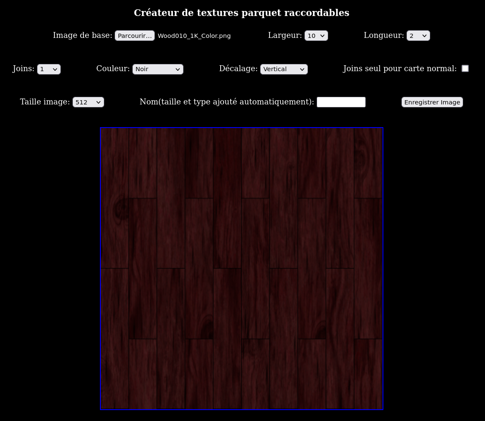
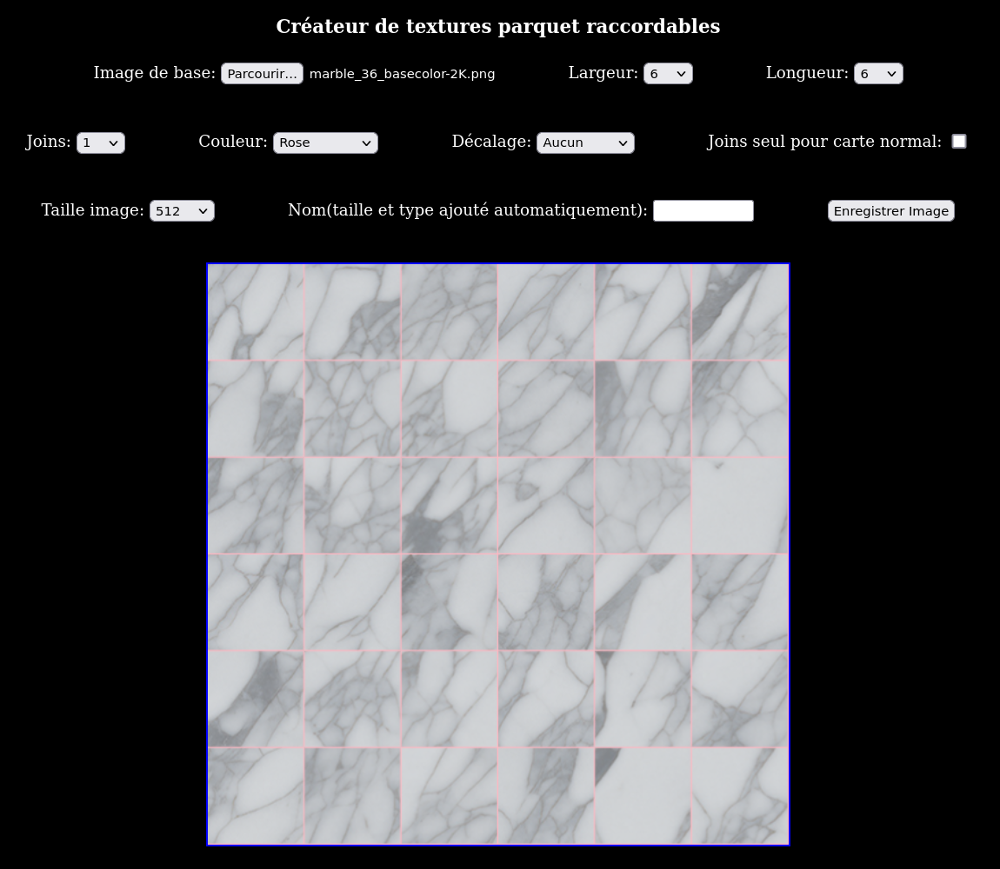
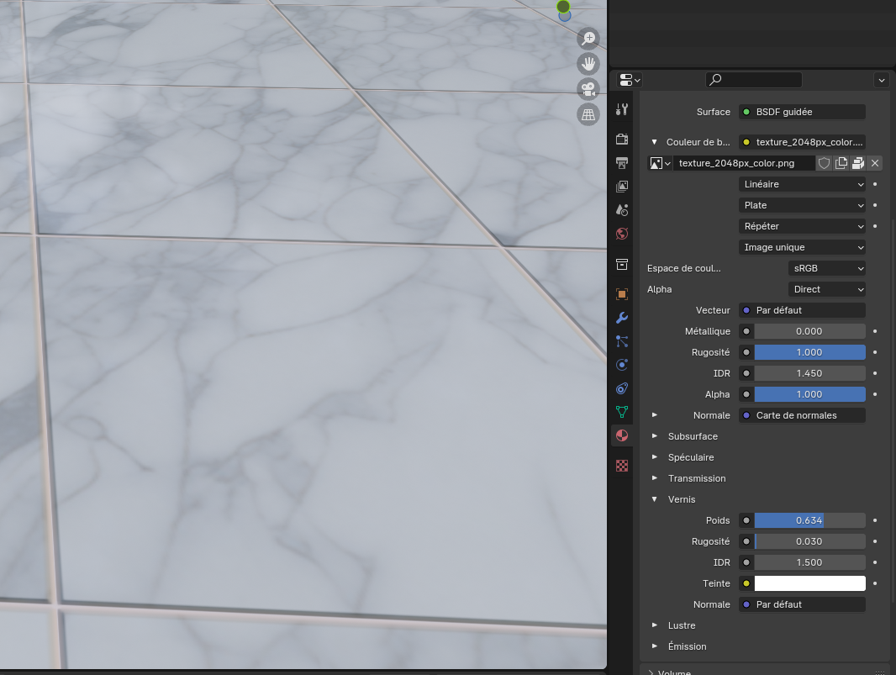

# tiles_maker
A simple floor textures seamless maker in html.

Un simple créateur(en html/javasript) de textures parquet/carrelages raccordables.

## Utilisation:

Ouvrez le fichier html dans votre nagivateur internet,

Chargez une texture de bois ou marbre, choississez l'épaisseur/couleur du joint, le décalage, la largeur/hauteur des carreaux, la résolution de la texture finale, puis enregistrez votre texture finale.

Il y a une option pour enregistrer qu'une texture avec les joints pour créer une carte de normale à partir de Gimp.

